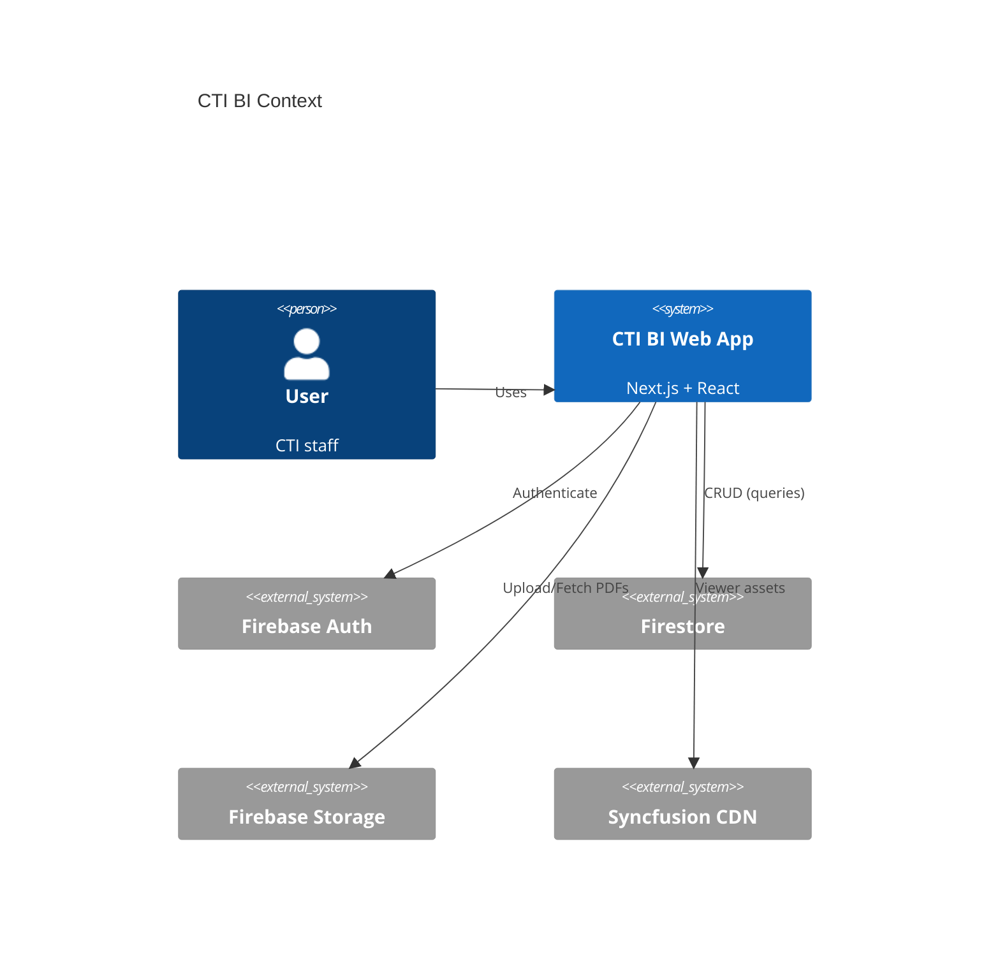
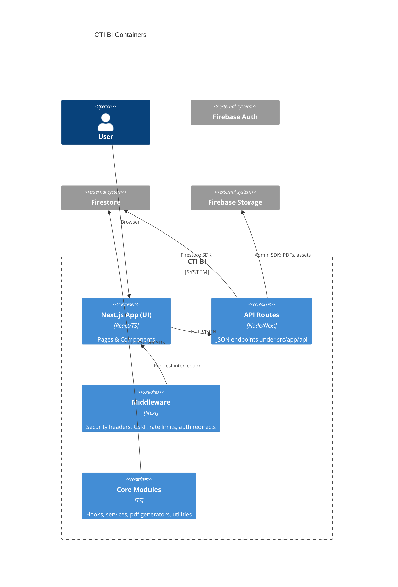

<p align="center">
  
</p>

# CTI BI – Project Architecture Blueprint

Generated: 2025-11-12

[!NOTE]
This blueprint reflects the current codebase: Next.js 15 (App Router), React 19, TypeScript, Firebase (Auth, Firestore, Storage, Admin SDK), Tailwind CSS 4, shadcn/Radix UI, Syncfusion PDF Viewer, Vitest.

## 1. Architecture Detection and Analysis

- Project type: React/Next.js (monolithic web app with server-side API routes)
- Primary pattern: Layered Monolith with serverless-style API handlers
- Key folders:
  - `src/app` routes, layouts, and pages
  - `src/components` UI and feature components
  - `src/hooks` cross-cutting hooks (auth, forms, keyboard, etc.)
  - `src/lib` core services/utilities (firebase init, pdf generators, security)
  - `src/services` Firestore access layer (repositories)
  - `src/types` shared domain types
  - `middleware.ts` security, CSRF, rate limiting, route protection
  - `public` static assets, service worker
- Dependencies indicate: Firebase client/admin, PDF generation and viewing, forms/validation (react-hook-form, zod), charts (recharts)

## 2. Architectural Overview

- Layered approach:
  - Presentation/UI: React components and pages in `src/app` and `src/components`
  - Application logic: Hooks and feature modules in `src/hooks` and `src/lib`
  - Data layer: Firestore repositories in `src/services`
  - Infrastructure: Firebase client/admin initialization, storage, PDF utilities
- Boundaries enforced by folder structure and typed interfaces from `src/types`
- Hybrid SSR/CSR with Next.js; protected routes via `middleware.ts`

## 3. Architecture Visualization (C4)

### Context (Level 1)


### Containers (Level 2)


### Components (Feature-Level)
```mermaid
flowchart LR
A[Components: Companies/Departments/Employees/Projects/Contracts] --> H[Hooks: use-auth/use-form/use-invoice]
H --> S[Services: Firestore repositories]
S --> DB[(Firestore Collections)]
A --> PDF[PDF Generators (src/lib/*pdf*.ts)]
PDF --> STG[(Firebase Storage)]
UI[App Router pages] --> MW[Middleware]
MW --> AUTH[(Auth Token/CSRF/Rate limit)]
```

[!TIP]
Use component-level diagrams when planning new features to see data and service impacts.

## 4. Core Architectural Components

- UI/Presentation (`src/app`, `src/components`)
  - Purpose: Views, interactions, accessibility, theming
  - Patterns: Composition, shadcn/Radix primitives, controlled forms
- Hooks (`src/hooks`)
  - Purpose: Cross-cutting concerns (auth, validation, keyboard, storage)
  - Patterns: Encapsulate side-effects and state; reusable APIs
- Services (`src/services/firestore.ts`)
  - Purpose: Repository-style Firestore CRUD per domain
  - Patterns: Collection functions, typed mapping, timestamping, ordering
- Core libs (`src/lib/*`)
  - Purpose: Firebase init (client/admin), security, PDF generation, utils
  - Patterns: Adapter-style wrappers around external SDKs; pure utilities when possible
- Middleware (`middleware.ts`)
  - Purpose: Security headers, CSRF validation, rate limiting, route protection
  - Patterns: Request interception with NextResponse; simple in-memory stores (dev)

## 5. Architectural Layers and Dependencies

- UI → Hooks → Services → Firestore/Storage
- API Routes → Services/Libs → Firestore/Storage
- Types shared across layers enforce contracts
- No strong circular dependencies observed; maintain separation by importing upward only through interfaces/utilities

## 6. Data Architecture

- Firestore collections observed:
  - `users`, `employees`, `departments`, `companies`, `clients`, `contracts`, `services`
  - `projects`, `resource_allocations`, `cti_timesheets`, `companyRateTemplates`
- Patterns:
  - Repository functions per collection with `createdAt/updatedAt` timestamps
  - Deterministic document IDs for key entities (e.g., `projects.poNumber`, `departments.departmentCode`)
  - Indexes managed via `firestore.indexes.json`
- Validation:
  - UI: react-hook-form + zod validators
  - Server: input normalization in services and API handlers

## 7. Cross-Cutting Concerns

- Authentication & Authorization
  - Firebase Auth; `use-auth` hook; role-based permissions via `ROLE_PERMISSIONS` in `src/types`
  - Middleware enforces protected routes and login redirects
- Error Handling & Resilience
  - `src/lib/api-error-handler.ts` centralizes API errors; user-friendly messages
  - Middleware rate limit for auth routes; CSRF on state-changing requests
- Logging & Monitoring
  - `src/lib/audit-logger.ts` for audit trails (extend as needed)
  - Diagnostic headers and SDK logs recommended for Firebase operations
- Configuration Management
  - `.env.local` for client/public and server secrets
  - Firebase emulator support in development via env vars

## 8. Service Communication Patterns

- Synchronous HTTP JSON via Next.js API routes in `src/app/api/**`
- Client-side calls use `secureRequest` adding CSRF and Authorization headers
- No message bus/event streaming detected; consider Pub/Sub for future async needs

## 9. Technology-Specific Patterns

- React/Next.js
  - App Router, server/client component mix, typed props
  - Routing via `src/app/**`, `middleware.ts` for global concerns
  - Security headers via `next.config.ts` and middleware
- Firebase
  - Client init in `src/lib/firebase-client.ts` with emulator support
  - Admin init in `src/lib/firebase-admin.ts` for server-side storage/PDF tasks
  - Firestore access encapsulated in `src/services/firestore.ts`
- PDF & Viewing
  - Generators in `src/lib/*pdf*.ts`; Syncfusion viewer under `src/components/pdf-viewer`

## 10. Implementation Patterns

- Interface & Types: Centralize domain types in `src/types`; prefer narrow interfaces
- Services/Repositories: CRUD functions per collection; deterministic IDs where practical
- API Handlers: Validate input, use `secureRequest` on client; standard JSON responses
- Domain Model: Entities with timestamps and role-based attributes; use zod for validation

## 11. Testing Architecture

- Tools: Vitest (`vitest.config.ts` present)
- Strategy:
  - Unit: pure utilities in `src/lib/**`, repository helpers in `src/services/**`
  - Integration: API handlers against emulator Firestore
  - UI: component behavior with mocked services/hooks
- Test data: fixtures per collection; prefer emulator-backed tests

## 12. Deployment Architecture

- Environment-specific config via `.env` and platform settings
- Build: `npm run build`; Start: `npm run start`
- Hosting: Vercel/Azure/custom Node; ensure Firebase service account for server-side tasks
- Security: Strict headers (HSTS prod), CSP in middleware, CSRF/rate limits

## 13. Extension and Evolution Patterns

- Feature Addition
  - New UI: add page/component in `src/app`/`src/components`
  - Data: add functions in `src/services/firestore.ts` for new collections
  - API: add route in `src/app/api/**` with validation and error handling
- Modification
  - Preserve typed contracts; maintain repository boundaries
  - Migrate data with helper utilities (`reference-migration-helpers.ts`)
- Integration
  - Use adapter modules in `src/lib/**`; avoid leaking SDK details to UI/components

## 14. Architecture Governance

- Consistency via folder boundaries and shared types
- ESLint config (`eslint.config.mjs`) enforces standards; adjust rules as needed
- PR reviews should verify layer boundaries and repository usage

## 15. Blueprint for New Development

- Workflow
  - Define domain types → services → API → hooks → UI
  - Add indexes to `firestore.indexes.json` if queries require
  - Secure endpoints (CSRF/auth) and add middleware checks if needed
- Templates
  - Repository function pattern from `src/services/firestore.ts`
  - API handler shape under `src/app/api/**`
  - Hook pattern from `src/hooks/use-async.ts`, `use-auth.ts`
- Pitfalls
  - Avoid direct SDK calls from UI; route through services or API
  - Keep secrets out of client bundle; use Admin SDK server-side only
  - Ensure indexes exist for production queries

## End-User Overview

This section explains the CTI BI web app for non-technical users.

### What you can do

- View dashboards for utilization, manpower, and project financials
- Manage core records: Companies, Departments, Employees, Projects, Contracts
- Upload and review timesheets; track approvals and updates
- Generate invoices from project and timesheet data; monitor payments
- View and download PDFs for reports and packets directly in the app

[!TIP]
Press ⌘K to open the command palette for quick navigation.

### Who uses it

- Administrators: configure users, companies, departments, permissions
- Finance: handle invoicing and payment tracking
- Project managers: manage projects, teams, services, allocations
- Employees: upload timesheets and review assignments

### Navigation

- Sidebar: main modules (Dashboard, Projects, Timesheets, Invoicing, Administration)
- Top actions: common shortcuts, search, theme toggle
- Command palette (⌘K): jump to pages or actions quickly

### Typical workflows

- Sign in and go to Dashboard to view quick stats
- Timesheets:
  - Upload timesheet files, review entries, and submit updates
  - Managers/Finance review and approve as needed
- Projects:
  - Create or update projects, assign team members and services
  - Track allocations and progress
- Invoicing:
  - Generate invoices from approved timesheets and contract data
  - Track payments and download invoice PDFs
- Documents:
  - Open report packets in the PDF viewer; export or share as needed

[!NOTE]
Data changes may take a moment to reflect across dashboards depending on approvals and syncing.

### Data overview (non-technical)

- People and org: Users, Employees, Departments, Companies
- Work and billing: Projects, Contracts, Services, Resource Allocations
- Activity: CTI Timesheets (work logs) and Company Rate Templates

### Access and permissions

- Role-based access controls ensure each user only sees actions relevant to their role
- If an action is unavailable, contact an administrator to review permissions

### Known limitations

- The app requires an internet connection; offline caching is not enabled by default
- Some advanced PDF viewer features are being integrated
- If you see an error, the app shows a friendly message and logs it for review

[!WARNING]
Do not share login details or sensitive documents outside approved channels.

### Roadmap and suggestions

- In-app PDF viewer enhancements (annotations, search, page thumbnails)
- Expanded automated testing for higher reliability
- Advanced analytics dashboards and reports
- Batch data import tools and improved CSV/XLSX validation
- Role management UI for easier permissions updates
- Optional offline/low-connectivity modes in the future

If you have feedback or feature requests, share specific examples of your workflow to help prioritize improvements.

---

[!IMPORTANT]
Keep this blueprint updated as modules evolve. Regenerate after significant changes to routes, services, or data models.
